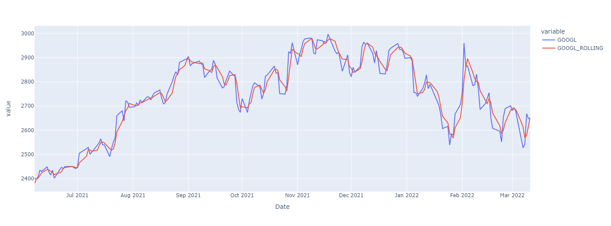

<a href="https://colab.research.google.com/github/londogard/londogard/blob/master/blog/2022-03-11-timeseries-pt-2/index.ipynb" target="_parent"></a>

<!--truncate-->

⚠️Please be aware that **this blog is much easier and nicer to read directly in `Colab` 👆 or through [GitHub](https://github.com/londogard/londogard/blob/master/blog/2022-03-11-timeseries-pt-1/index.ipynb)**!


# \[CA\]: Time Series #2 - Predicting Stock Prices (Time Series) using classical Machine Learning

`CA=Competence Afternoon`

To learn more about Time Series and how one can analyze them please view the other parts,

1. [Part One - Decomposing & Working with Time Series (theoretical)](https://blog.londogard/timeseries-pt-1)
2. [Part Two - Predicting Stock Prices (Time Series) using classical Machine Learning](https://blog.londogard/timeseries-pt-2)
3. [Part Three -Forecasting Cryptocurrency Prices (Time Series) using Deep Learning (PyTorch, Tensorflow/Keras & darts)](https://blog.londogard/timeseries-pt-3)

## Predicting Time Series 📈

Today we will move from learning how to analyze Time Series to actually predicting them using simple models and data.

We'll be predicting Stocks from the top tech companies like Apple & Google.  
In [part #3](https://blog.londogard/timeseries-pt-3) we'll move back to the crypto world!

To be able to predict the data we must understand it and we'll make a minor analysis.

### Installation & Imports

Feel free to ignore the cells and simply run them, the lazy style 🥱

Installing the important libraries...


```python
from IPython.display import clear_output
!pip install -U pandas_datareader
!pip install plotly
!pip install matplotlib==3.1.3

clear_output()
```

And importing them...


```python
import pandas as pd # data processing, CSV file I/O (e.g. pd.read_csv)
import numpy as np  # linear algebra
import pandas_datareader as pdr
import seaborn as sns

from datetime import datetime
```

### Minor Analysis


```python
df = pdr.get_data_yahoo(['AAPL', 'GOOGL', 'AMZN', 'MSFT', 'GE'])
df.head()
```


<div>
<table border="1" class="dataframe">
  <thead>
    <tr>
      <th>Attributes</th>
      <th colspan="5" halign="left">Adj Close</th>
      <th colspan="5" halign="left">Close</th>
      <th>...</th>
      <th colspan="5" halign="left">Open</th>
      <th colspan="5" halign="left">Volume</th>
    </tr>
    <tr>
      <th>Symbols</th>
      <th>AAPL</th>
      <th>GOOGL</th>
      <th>AMZN</th>
      <th>MSFT</th>
      <th>GE</th>
      <th>AAPL</th>
      <th>GOOGL</th>
      <th>AMZN</th>
      <th>MSFT</th>
      <th>GE</th>
      <th>...</th>
      <th>AAPL</th>
      <th>GOOGL</th>
      <th>AMZN</th>
      <th>MSFT</th>
      <th>GE</th>
      <th>AAPL</th>
      <th>GOOGL</th>
      <th>AMZN</th>
      <th>MSFT</th>
      <th>GE</th>
    </tr>
    <tr>
      <th>Date</th>
      <th></th>
      <th></th>
      <th></th>
      <th></th>
      <th></th>
      <th></th>
      <th></th>
      <th></th>
      <th></th>
      <th></th>
      <th></th>
      <th></th>
      <th></th>
      <th></th>
      <th></th>
      <th></th>
      <th></th>
      <th></th>
      <th></th>
      <th></th>
      <th></th>
    </tr>
  </thead>
  <tbody>
    <tr>
      <th>2017-03-14</th>
      <td>32.807190</td>
      <td>865.909973</td>
      <td>852.530029</td>
      <td>60.125767</td>
      <td>212.658173</td>
      <td>34.747501</td>
      <td>865.909973</td>
      <td>852.530029</td>
      <td>64.410004</td>
      <td>227.230774</td>
      <td>...</td>
      <td>34.825001</td>
      <td>863.750000</td>
      <td>853.549988</td>
      <td>64.529999</td>
      <td>228.923080</td>
      <td>61236400.0</td>
      <td>1061700.0</td>
      <td>2130600.0</td>
      <td>14280200.0</td>
      <td>2964208.0</td>
    </tr>
    <tr>
      <th>2017-03-15</th>
      <td>33.154175</td>
      <td>868.390015</td>
      <td>852.969971</td>
      <td>60.443142</td>
      <td>214.241959</td>
      <td>35.115002</td>
      <td>868.390015</td>
      <td>852.969971</td>
      <td>64.750000</td>
      <td>228.923080</td>
      <td>...</td>
      <td>34.852501</td>
      <td>867.940002</td>
      <td>854.330017</td>
      <td>64.550003</td>
      <td>227.307693</td>
      <td>102767200.0</td>
      <td>1332900.0</td>
      <td>2562200.0</td>
      <td>24833800.0</td>
      <td>3268564.0</td>
    </tr>
    <tr>
      <th>2017-03-16</th>
      <td>33.208466</td>
      <td>870.000000</td>
      <td>853.419983</td>
      <td>60.340454</td>
      <td>214.169983</td>
      <td>35.172501</td>
      <td>870.000000</td>
      <td>853.419983</td>
      <td>64.639999</td>
      <td>228.846161</td>
      <td>...</td>
      <td>35.180000</td>
      <td>870.530029</td>
      <td>855.299988</td>
      <td>64.750000</td>
      <td>229.230774</td>
      <td>76928000.0</td>
      <td>1104500.0</td>
      <td>1842300.0</td>
      <td>20674300.0</td>
      <td>2756910.0</td>
    </tr>
    <tr>
      <th>2017-03-17</th>
      <td>33.043240</td>
      <td>872.369995</td>
      <td>852.309998</td>
      <td>60.555153</td>
      <td>215.105835</td>
      <td>34.997501</td>
      <td>872.369995</td>
      <td>852.309998</td>
      <td>64.870003</td>
      <td>229.846161</td>
      <td>...</td>
      <td>35.250000</td>
      <td>873.679993</td>
      <td>853.489990</td>
      <td>64.910004</td>
      <td>229.615387</td>
      <td>175540000.0</td>
      <td>1868300.0</td>
      <td>3384400.0</td>
      <td>49219700.0</td>
      <td>5673070.0</td>
    </tr>
    <tr>
      <th>2017-03-20</th>
      <td>33.390213</td>
      <td>867.909973</td>
      <td>856.969971</td>
      <td>60.611160</td>
      <td>214.097946</td>
      <td>35.365002</td>
      <td>867.909973</td>
      <td>856.969971</td>
      <td>64.930000</td>
      <td>228.769226</td>
      <td>...</td>
      <td>35.099998</td>
      <td>869.479980</td>
      <td>851.510010</td>
      <td>64.910004</td>
      <td>230.000000</td>
      <td>86168000.0</td>
      <td>1542200.0</td>
      <td>2282700.0</td>
      <td>14598100.0</td>
      <td>2454062.0</td>
    </tr>
  </tbody>
</table>
<p>5 rows × 30 columns</p>
</div>


Looks fine, but how much data did we download?  
We can view the `.index` which is a `DateTimeIndex` and figure out how it stretches.


```python
df.index[0],df.index[-1]
```


    (Timestamp('2017-03-14 00:00:00'), Timestamp('2022-03-11 00:00:00'))


Hmm, 5 years, that should be enough to find some kind of patterns.  
Now let us analyze this data further by looking at if the stocks correlate somehow! 🤠
  
> **N.B.** this analysis was first done by Heidi Mach, it's something I would never have done myself. Really cool results incoming!


```python
df['Adj Close'].corr().style.background_gradient(cmap="Blues")
```


<table id="T_ad2a9_">
  <thead>
    <tr>
      <th class="index_name level0" >Symbols</th>
      <th class="col_heading level0 col0" >AAPL</th>
      <th class="col_heading level0 col1" >GOOGL</th>
      <th class="col_heading level0 col2" >AMZN</th>
      <th class="col_heading level0 col3" >MSFT</th>
      <th class="col_heading level0 col4" >GE</th>
    </tr>
    <tr>
      <th class="index_name level0" >Symbols</th>
      <th class="blank col0" >&nbsp;</th>
      <th class="blank col1" >&nbsp;</th>
      <th class="blank col2" >&nbsp;</th>
      <th class="blank col3" >&nbsp;</th>
      <th class="blank col4" >&nbsp;</th>
    </tr>
  </thead>
  <tbody>
    <tr>
      <th id="T_ad2a9_level0_row0" class="row_heading level0 row0" >AAPL</th>
      <td id="T_ad2a9_row0_col0" class="data row0 col0" >1.000000</td>
      <td id="T_ad2a9_row0_col1" class="data row0 col1" >0.951564</td>
      <td id="T_ad2a9_row0_col2" class="data row0 col2" >0.934927</td>
      <td id="T_ad2a9_row0_col3" class="data row0 col3" >0.978283</td>
      <td id="T_ad2a9_row0_col4" class="data row0 col4" >-0.282471</td>
    </tr>
    <tr>
      <th id="T_ad2a9_level0_row1" class="row_heading level0 row1" >GOOGL</th>
      <td id="T_ad2a9_row1_col0" class="data row1 col0" >0.951564</td>
      <td id="T_ad2a9_row1_col1" class="data row1 col1" >1.000000</td>
      <td id="T_ad2a9_row1_col2" class="data row1 col2" >0.866374</td>
      <td id="T_ad2a9_row1_col3" class="data row1 col3" >0.960317</td>
      <td id="T_ad2a9_row1_col4" class="data row1 col4" >-0.191266</td>
    </tr>
    <tr>
      <th id="T_ad2a9_level0_row2" class="row_heading level0 row2" >AMZN</th>
      <td id="T_ad2a9_row2_col0" class="data row2 col0" >0.934927</td>
      <td id="T_ad2a9_row2_col1" class="data row2 col1" >0.866374</td>
      <td id="T_ad2a9_row2_col2" class="data row2 col2" >1.000000</td>
      <td id="T_ad2a9_row2_col3" class="data row2 col3" >0.944168</td>
      <td id="T_ad2a9_row2_col4" class="data row2 col4" >-0.498395</td>
    </tr>
    <tr>
      <th id="T_ad2a9_level0_row3" class="row_heading level0 row3" >MSFT</th>
      <td id="T_ad2a9_row3_col0" class="data row3 col0" >0.978283</td>
      <td id="T_ad2a9_row3_col1" class="data row3 col1" >0.960317</td>
      <td id="T_ad2a9_row3_col2" class="data row3 col2" >0.944168</td>
      <td id="T_ad2a9_row3_col3" class="data row3 col3" >1.000000</td>
      <td id="T_ad2a9_row3_col4" class="data row3 col4" >-0.373495</td>
    </tr>
    <tr>
      <th id="T_ad2a9_level0_row4" class="row_heading level0 row4" >GE</th>
      <td id="T_ad2a9_row4_col0" class="data row4 col0" >-0.282471</td>
      <td id="T_ad2a9_row4_col1" class="data row4 col1" >-0.191266</td>
      <td id="T_ad2a9_row4_col2" class="data row4 col2" >-0.498395</td>
      <td id="T_ad2a9_row4_col3" class="data row4 col3" >-0.373495</td>
      <td id="T_ad2a9_row4_col4" class="data row4 col4" >1.000000</td>
    </tr>
  </tbody>
</table>


Holy macaron, that's a lot more correlated data than I expected! 🙀  

The `seaborn` library has a function called `pairplot` which plots this correlation, but using the points which is visually interesting in comparison to simply seeing the table above.


```python
df = df['Adj Close']
df = df.drop(columns="GE")
```


```python
sns.pairplot(df.drop_duplicates())
```


    <seaborn.axisgrid.PairGrid at 0x7f1fbb4ef650>


    

    


Does this in fact mean what that we can predict prices of a stock based on their competition? The correlation does suggest so.

Let's try it!

First we'll try using a `LinearRegression` which simply said fits a line to be as close to all points as possible.


> Source: Wikipedia.org

First we import `LinearRegression` through `scikit-learn` and then we add `train_test_split` which allows us to split our data into a training and testing dataset.

Whenever you test your Machine Learning or Deep Learning Models you never want to test it on data that it has trained on, as you might've overfitted the data and have a really good result until you see new data points.

The end-goal of a model is to generalize a problem and find the local minima which optimizes the funtion for the data points. By only looking at the same data we can't be sure we generalized correctly.

And the code 👩‍💻


```python
from sklearn.linear_model import LinearRegression
from sklearn.model_selection import train_test_split
from sklearn.metrics import r2_score, mean_absolute_error

non_google_df = df.drop(columns="GOOGL")
X_train, X_valid, y_train, y_valid = train_test_split(non_google_df, df['GOOGL'], test_size=0.2)

clf = LinearRegression()
```

We got our data divided into `valid` and `train`, we got a regression model in our `clf`.

Let us predict the data and view our `r2_score` and `mean_absolute_error`.

> 💡  
> **r2_score:**  _(coefficient of determination) regression score function._  
> Best possible score is 1.0 and it can be negative (because the model can be arbitrarily worse). A constant model that always predicts the expected value of y, disregarding the input features, would get a  score of 0.0.
>
> **mean_absolute_error:** _Mean absolute error regression loss._


```python
clf.fit(X_train, y_train)
preds = clf.predict(X_valid)

r2_score(y_valid, preds), mean_absolute_error(y_valid, preds)
```


    (0.9431732611282428, 130.75344061010207)


**$R^2 = 93 \%$** 🥳

That's actually not bad at all, the `mean_absolute_error` being 129.7 is not very telling. Either we have to view the data to understand the magnituide, or we can apply `MAPE` which is the _Mean Absolute Percentage Error_.  

Not sure if I'm lazy or simply want to show you the other function 🤔, but I'll use `MAPE`!


```python
from sklearn.metrics import mean_absolute_percentage_error

mean_absolute_percentage_error(y_valid, preds)
```


    0.0854923639443305


$< 9\%$  
Pretty acceptable considering we have not done anything except deliver data to one of the simplest models that exists!  

Let's show this visually!


```python
import plotly.express as px

# px.line(y=[y_valid, preds])
```

<details>
<summary>Show Plotly Chart (code cell only visible in active notebook)</summary>


</details>

Looks pretty good, but it is very messy... Something is off right?

The index is not a `DateTimeIndex` anymore because we shuffled the data in `train_test_split` -- a big difference is thereby applied.


```python
y_valid.plot()
```


    <matplotlib.axes._subplots.AxesSubplot at 0x7f1fb5e5f310>


    

    


```python
y_valid.plot(legend="Valid")
pd.Series(preds, index=y_valid.index).plot(legend="Pred")
```


    <matplotlib.axes._subplots.AxesSubplot at 0x7f1fb5dd5190>


    

    


Looks pretty fly, but can we take it further?  
...yes we can! 😎

I see a few options, the two first being:

1. Scaling the data as errors at the end are larger than in the beggining based on stocks rising.
2. `LinearRegression` is a very simple yet efficient model that we can try to replace.

Let's start with the second point, `scikit-learn` has a multitude of regression-models, one being `RandomForestRegressor` that's pretty strong.


```python
from sklearn.ensemble import RandomForestRegressor

clf = RandomForestRegressor()
clf.fit(X_train, y_train)

preds = clf.predict(X_valid)
r2_score(y_valid, preds), mean_absolute_percentage_error(y_valid, preds)
```


    (0.9971090451830482, 0.015725346089653435)


😲$R^2 >99\%$

That's actually crazy. And `MAPE` is not even 2%.

Let's view it!


```python
y_valid.plot(legend="Valid")
pd.Series(preds, index=y_valid.index).plot(legend="Pred")
```


    <matplotlib.axes._subplots.AxesSubplot at 0x7f1fcaeacad0>


    

    


That's an incredibly fitted curve.

**How is this possible?**  
1. We most likely overfit the data.  
2. We are looking at `AMZN`, `AAPL` and more data that is highly correlated during the **same** day as the one we wish to predict. 
  - In the end this is a **useless task**, if we know the prices of today we'd also know `GOOGL`'s prices!
3. We're using shuffled data, meaning that in a way we've seen the future and past values surrounding the predicted one. This is a regression problem and not really a forecasting problem, which is simpler than forecasting.

**Impressive nontheless**  
Even as I'm aware of all the drawbacks I'm thouroughly impresed by the results we're seeing.  

**Making it more interesting**  
We should make use of the previous days data to make sure we are not "cheating".

Let's get on it! 🎯

---

We'll be able to move, or _shift_, the data using ˋpd.DataFrame.shiftˋ which shifts the data either forwad ($+X$) or backwards ($-X$).

And while we're at it, let's group this up into a function.

> ℹ️  
> [`pd.DataFrame.shift`](https://pandas.pydata.org/docs/reference/api/pandas.DataFrame.shift.html): _Shift index by desired number of periods with an optional time freq._  


```python
def fit_validate_plot(X_train, X_valid, y_train, y_valid):
  clf = RandomForestRegressor()
  clf.fit(X_train, y_train)

  preds = clf.predict(X_valid)
  pd.DataFrame({'Valid': y_valid, 'Preds': preds}, index=y_valid.index).plot()
  
  print(f"""
  $R^2$: {r2_score(y_valid, preds)}
  MAPE: {mean_absolute_percentage_error(y_valid, preds)}
  MAE: {mean_absolute_error(y_valid, preds)}
  """)
```

And making use of it will now be easy! 😍  
_Refactoring_ and _abstractions_ are incredibly important.


```python
X_train, X_valid, y_train, y_valid = train_test_split(df.drop(columns="GOOGL").shift(1).iloc[1:], df['GOOGL'].iloc[1:], test_size=0.2)

fit_validate_plot(X_train, X_valid, y_train, y_valid)
```

    
      $R^2$: 0.9948464033958241
      MAPE: 0.019439064157954267
      MAE: 29.527943362281434
      


    

    


🤯 this is crazy impressive!

We made the task at hands legit by only using historical data of `GOOGL`'s competitors. The $R^2$  and `MAPE` is incredible.  

It'd be interesting to investigate how badly we overfit the data, but that's for another day.

And how about if we **don't** shuffle the data? E.g. we do an actual forecast and not regression!


```python
X_train, X_valid, y_train, y_valid = train_test_split(df.drop(columns="GOOGL").shift(1).iloc[1:], df['GOOGL'].iloc[1:], test_size=0.2, shuffle=False)

fit_validate_plot(X_train, X_valid, y_train, y_valid)
```

    
      $R^2$: -7.02034763602467
      MAPE: 0.24152517366886156
      MAE: 660.6506098187159
      


    

    


🤯😭

What are we seeing and why?  
**Regression** algorithms/models try to fit a line to multiple points and it should be able to guess what point the data has depending on its features. In our case the regression algorithm has never seen data as high as above `y_train.max()`, which means it can't guess the data.

Don't trust me? Simply validate by looking at the chart 👆.


What's one way to fix this? **Scaling**  
How will we try to achieve this practically? **LogReturn**

> 💡
> You can also take the %-difference, which according to Taylors Theorem will approximate the LogReturn.


```python
def log_return(x: pd.DataFrame) -> pd.DataFrame:
  return x.apply(lambda x: np.log(x/x.shift(1))).dropna()

log_return(df).head()
```


<div>
<table border="1" class="dataframe">
  <thead>
    <tr style="text-align: right;">
      <th>Symbols</th>
      <th>AAPL</th>
      <th>GOOGL</th>
      <th>AMZN</th>
      <th>MSFT</th>
    </tr>
    <tr>
      <th>Date</th>
      <th></th>
      <th></th>
      <th></th>
      <th></th>
    </tr>
  </thead>
  <tbody>
    <tr>
      <th>2017-03-15</th>
      <td>0.010521</td>
      <td>0.002860</td>
      <td>0.000516</td>
      <td>0.005265</td>
    </tr>
    <tr>
      <th>2017-03-16</th>
      <td>0.001636</td>
      <td>0.001852</td>
      <td>0.000527</td>
      <td>-0.001700</td>
    </tr>
    <tr>
      <th>2017-03-17</th>
      <td>-0.004988</td>
      <td>0.002720</td>
      <td>-0.001301</td>
      <td>0.003552</td>
    </tr>
    <tr>
      <th>2017-03-20</th>
      <td>0.010446</td>
      <td>-0.005126</td>
      <td>0.005453</td>
      <td>0.000924</td>
    </tr>
    <tr>
      <th>2017-03-21</th>
      <td>-0.011518</td>
      <td>-0.020687</td>
      <td>-0.016199</td>
      <td>-0.011151</td>
    </tr>
  </tbody>
</table>
</div>


```python
df_lr = log_return(df)
X_train, X_valid, y_train, y_valid = train_test_split(df_lr.drop(columns="GOOGL").shift(1).iloc[1:], df_lr['GOOGL'].iloc[1:], test_size=0.2, shuffle=False)

fit_validate_plot(X_train, X_valid, y_train, y_valid)
```

    
      $R^2$: -0.15979886803424925
      MAPE: 33272784735.11796
      MAE: 0.01244440133653395
      


    

    


Most certainly **not** perfect... Forecasting seems harder than expected based on our initial results...  
And that's really because we weren't forecasting before, we were solving a _regression-problem_

Perhaps we need to use more data than simply the previous day?


### Predicting Based on historical performance
We might predict based on historical performance.


```python
df.head()
```


<div>

<table border="1" class="dataframe">
  <thead>
    <tr style="text-align: right;">
      <th>Symbols</th>
      <th>AAPL</th>
      <th>GOOGL</th>
      <th>AMZN</th>
      <th>MSFT</th>
    </tr>
    <tr>
      <th>Date</th>
      <th></th>
      <th></th>
      <th></th>
      <th></th>
    </tr>
  </thead>
  <tbody>
    <tr>
      <th>2017-03-14</th>
      <td>32.807190</td>
      <td>865.909973</td>
      <td>852.530029</td>
      <td>60.125767</td>
    </tr>
    <tr>
      <th>2017-03-15</th>
      <td>33.154175</td>
      <td>868.390015</td>
      <td>852.969971</td>
      <td>60.443142</td>
    </tr>
    <tr>
      <th>2017-03-16</th>
      <td>33.208466</td>
      <td>870.000000</td>
      <td>853.419983</td>
      <td>60.340454</td>
    </tr>
    <tr>
      <th>2017-03-17</th>
      <td>33.043240</td>
      <td>872.369995</td>
      <td>852.309998</td>
      <td>60.555153</td>
    </tr>
    <tr>
      <th>2017-03-20</th>
      <td>33.390213</td>
      <td>867.909973</td>
      <td>856.969971</td>
      <td>60.611160</td>
    </tr>
  </tbody>
</table>
</div>


```python
df = df[['GOOGL']]
df.head()
```


<div>

<table border="1" class="dataframe">
  <thead>
    <tr style="text-align: right;">
      <th>Symbols</th>
      <th>GOOGL</th>
    </tr>
    <tr>
      <th>Date</th>
      <th></th>
    </tr>
  </thead>
  <tbody>
    <tr>
      <th>2017-03-14</th>
      <td>865.909973</td>
    </tr>
    <tr>
      <th>2017-03-15</th>
      <td>868.390015</td>
    </tr>
    <tr>
      <th>2017-03-16</th>
      <td>870.000000</td>
    </tr>
    <tr>
      <th>2017-03-17</th>
      <td>872.369995</td>
    </tr>
    <tr>
      <th>2017-03-20</th>
      <td>867.909973</td>
    </tr>
  </tbody>
</table>
</div>


✅ Only Google Data  
❌ Historical Data

So what should we do? One way to solve this is to use `shift` multiple times.


```python
def build_history(df: pd.DataFrame, num_back: int) -> pd.DataFrame:
  for i in range(num_back):
    df.loc[:, f"t_{i}"] = df['GOOGL'].shift(i + 1)
  
  return df

build_history(df, 3).head()
```


<div>

<table border="1" class="dataframe">
  <thead>
    <tr style="text-align: right;">
      <th>Symbols</th>
      <th>GOOGL</th>
      <th>t_0</th>
      <th>t_1</th>
      <th>t_2</th>
    </tr>
    <tr>
      <th>Date</th>
      <th></th>
      <th></th>
      <th></th>
      <th></th>
    </tr>
  </thead>
  <tbody>
    <tr>
      <th>2017-03-14</th>
      <td>865.909973</td>
      <td>NaN</td>
      <td>NaN</td>
      <td>NaN</td>
    </tr>
    <tr>
      <th>2017-03-15</th>
      <td>868.390015</td>
      <td>865.909973</td>
      <td>NaN</td>
      <td>NaN</td>
    </tr>
    <tr>
      <th>2017-03-16</th>
      <td>870.000000</td>
      <td>868.390015</td>
      <td>865.909973</td>
      <td>NaN</td>
    </tr>
    <tr>
      <th>2017-03-17</th>
      <td>872.369995</td>
      <td>870.000000</td>
      <td>868.390015</td>
      <td>865.909973</td>
    </tr>
    <tr>
      <th>2017-03-20</th>
      <td>867.909973</td>
      <td>872.369995</td>
      <td>870.000000</td>
      <td>868.390015</td>
    </tr>
  </tbody>
</table>
</div>


Notice how $t_0$ is the previous value, $t_1$ two steps back, and so on.  
This is actually _very_ memory intense as our data grows X times, one time per time step we build. In [part #3](INSERT) we'll go through how one can solve this issue.

No we need to drop all places where we don't have any history. That is easily achieved by dropping `NaN`.

> ℹ️  
> [`pd.DataFrame.dropna`](https://pandas.pydata.org/docs/reference/api/pandas.DataFrame.dropna.html): _Remove missing values._  
> `axis` attribute tells if you wish to drop rows or columns based on `NaN`, default is row.


```python
df = build_history(df, 7)
df = df.dropna()
df.head()
```


<div>
<table border="1" class="dataframe">
  <thead>
    <tr style="text-align: right;">
      <th>Symbols</th>
      <th>GOOGL</th>
      <th>t_0</th>
      <th>t_1</th>
      <th>t_2</th>
      <th>t_3</th>
      <th>t_4</th>
      <th>t_5</th>
      <th>t_6</th>
    </tr>
    <tr>
      <th>Date</th>
      <th></th>
      <th></th>
      <th></th>
      <th></th>
      <th></th>
      <th></th>
      <th></th>
      <th></th>
    </tr>
  </thead>
  <tbody>
    <tr>
      <th>2017-03-23</th>
      <td>839.650024</td>
      <td>849.799988</td>
      <td>850.140015</td>
      <td>867.909973</td>
      <td>872.369995</td>
      <td>870.000000</td>
      <td>868.390015</td>
      <td>865.909973</td>
    </tr>
    <tr>
      <th>2017-03-24</th>
      <td>835.140015</td>
      <td>839.650024</td>
      <td>849.799988</td>
      <td>850.140015</td>
      <td>867.909973</td>
      <td>872.369995</td>
      <td>870.000000</td>
      <td>868.390015</td>
    </tr>
    <tr>
      <th>2017-03-27</th>
      <td>838.510010</td>
      <td>835.140015</td>
      <td>839.650024</td>
      <td>849.799988</td>
      <td>850.140015</td>
      <td>867.909973</td>
      <td>872.369995</td>
      <td>870.000000</td>
    </tr>
    <tr>
      <th>2017-03-28</th>
      <td>840.630005</td>
      <td>838.510010</td>
      <td>835.140015</td>
      <td>839.650024</td>
      <td>849.799988</td>
      <td>850.140015</td>
      <td>867.909973</td>
      <td>872.369995</td>
    </tr>
    <tr>
      <th>2017-03-29</th>
      <td>849.869995</td>
      <td>840.630005</td>
      <td>838.510010</td>
      <td>835.140015</td>
      <td>839.650024</td>
      <td>849.799988</td>
      <td>850.140015</td>
      <td>867.909973</td>
    </tr>
  </tbody>
</table>
</div>


LGTM ✅

---

Let's scale our data and then make predictions.  
As previously,

1. Scale data
2. Split data
3. Fit data
4. Predict data
5. Validate


```python
df_lr = log_return(df)
X_train, X_valid, y_train, y_valid = train_test_split(df_lr.iloc[:, 1:], df_lr['GOOGL'], test_size=0.2, shuffle=False)

fit_validate_plot(X_train, X_valid, y_train, y_valid)
```

    
      $R^2$: -0.09291251083922969
      MAPE: 10166738051.820312
      MAE: 0.01198089072877809
      


    

    


Not great, not awful. Some self-exercises:

1. How would we do without scaling?
2. How would we do without shuffling?
3. Any other ideas? Try 'em out!


```python
# Test your own ideas
```

If you didn't try previously, try appling a rolling mean and rerun  `fit_validate_plot` as this should reduce the "swings" and thereby be a little bit more predictable.

> 💡
> [`pd.DataFrame.Rolling`](https://pandas.pydata.org/docs/reference/api/pandas.DataFrame.rolling.html): _Provide rolling window calculations._  
> In other words: We slide a window on our data and do calculations, in our case `mean`. This window includes `window`, `min_periods`, `center` & more attributes which impacts size of window, how large minimal window can be, and more.

Validating what `rolling.mean()` does to our data:


```python
df['GOOGL_ROLLING'] = df['GOOGL'].rolling(3).mean()  # Rolling over 3 days mean
df[-100:].plot(y=['GOOGL', 'GOOGL_ROLLING'])
```


    <matplotlib.axes._subplots.AxesSubplot at 0x7f1fb531bc90>


    

    


Zooming 🔍


```python
df_last_months = df[df.index > datetime(2021, 6, 6)]

# df_last_months.plot(y=['GOOGL', 'GOOGL_ROLLING'], backend='plotly')
```

<details>
<summary>Show Plotly Chart (code cell only visible in active notebook)</summary>


</details>

The curve is _very_ similar, but different.  

> **Self-exercise**: Test applying different functions like `min`, `max` and expanding window size into more days.

And validating what this does to our prediction.


```python
df_lr = df.pct_change().dropna().rolling(3).mean().dropna()
X_train, X_valid, y_train, y_valid = train_test_split(df_lr.iloc[:, 1:], df_lr['GOOGL'], test_size=0.2, shuffle=False)

fit_validate_plot(X_train, X_valid, y_train, y_valid)
```

    
      $R^2$: 0.8997161594986378
      MAPE: 0.8209516085248725
      MAE: 0.0019317335823510523
      


    

    


We're back! 🥳

It's not perfect, but we got something. And we can work with something. We can work with something... :)

> **Self-exercise**: Validat how `rolling` would affect our non-history-based forecasting

Let's reverse our transformation to see what we'd actually predict in the end.


```python
y_rolling = df['GOOGL'].rolling(3).mean().dropna()
y_train_non_scaled, y_valid_non_scaled = train_test_split(y_rolling, test_size=0.2, shuffle=False)
```


```python
clf = RandomForestRegressor()
clf.fit(X_train, y_train)
preds = clf.predict(X_valid)

preds = (preds + 1).cumprod() # Cummulative multiplication, first day + 1%, but then we got -1%, that's 1.01 * 0.99
preds = preds * y_train_non_scaled.iloc[-1] # Scaling it up based on the last training value

# pd.DataFrame({'Preds': preds, 'Valid Rolling': y_valid_non_scaled[1:], 'Valid': df['GOOGL'].iloc[-len(preds):]}).plot(backend='plotly')
```

<details>
<summary>Show Plotly Chart (code cell only visible in active notebook)</summary>


</details>

Seems as we're a little low in our predictions, but the curve is followed after all.

**What issues are left?**

1. We are not using an `AutoRegressive` model which might be interesting.
  - More about this in the next session
2. We are not using the "better" models, e.g. Neural Networks or statistic-model for Time Series like `ARIMA`.

Personally I'm very pleased with the results and can't wait to get started on **part #3**!

---

To learn more about Time Series and how one can analyze them please view the other parts,

1. [Part One - Decomposing & Working with Time Series (theoretical)](https://blog.londogard/timeseries-pt-1)
2. [Part Two - Predicting Stock Prices (Time Series) using classical Machine Learning](https://blog.londogard/timeseries-pt-2)
3. [Part Three -Forecasting Cryptocurrency Prices (Time Series) using Deep Learning (PyTorch, Tensorflow/Keras & darts)](https://blog.londogard/timeseries-pt-3)


---


#### Extra Self Exercises

1. Try different window-sizes with `rolling`
1. Try different length of history to predict new result on
1. Test new architectures
1. Find your own way to improve the results
