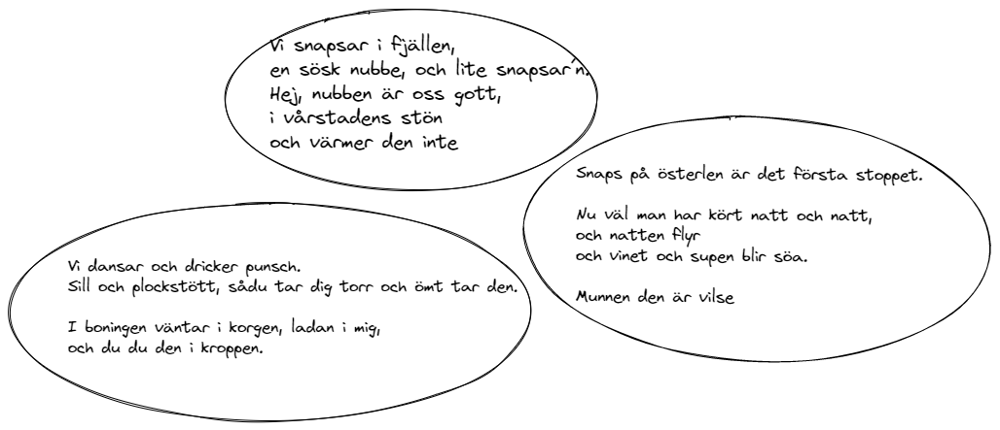
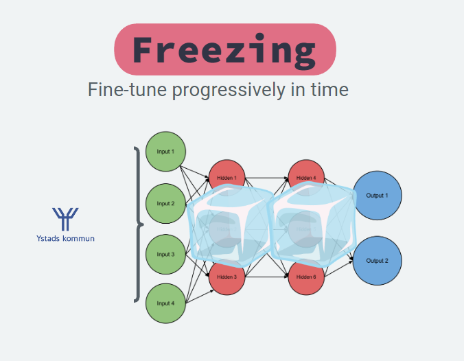
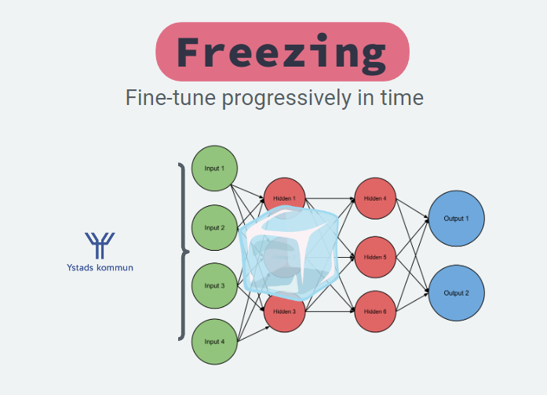
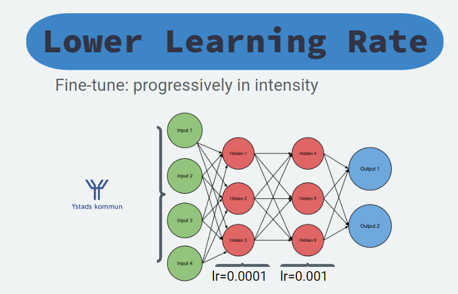

This midsummer my friends gave me the idea that I should generate Swedish Drinking Songs, or _Snapsvisor_, using Machine Learning and I thought it could be a lot of fun! 🍻  

  

To achieve the best results I'd need access to GPT-3, or equivalent model, alas I don’t and as such I needed  to do some extra work! Fun work though! 🤓

First some examples:

  
<!--truncate-->

Why GPT-3?

- Possible to do _prompt engineering_, which gwern has a great [blog on](https://www.gwern.net/GPT-3#prompts-as-programming)
    - TL;DR prompt engineering allows you to write a prompt and get a response, e.g. “step-by-step how to write a blog” and the return the step-by-step.
- Much better zero-/one-/few-shot learning
    - Because the model has a ton more parameters and trained on a larger dataset


Drawbacks with GPT-2:
- The performance is noticable worse because of the lower parameters and less data, sometimes called tokens, used to train the model.

As such the result is not amazing, but it's capable and really funny - based on the premise that you know Swedish!

**It's available on the [HuggingFace Hub](https://huggingface.co/lunde/gpt2-snapsvisor)** with a **inference widget** and **as a pre-trained model**, which can generate your own _Snapsvisor_ - N.B. it removes newlines. 

```python
from transformers import AutoTokenizer, AutoModelForCausalLM

tokenizer = AutoTokenizer.from_pretrained("lunde/gpt2-snapsvisor")
model = AutoModelForCausalLM.from_pretrained("lunde/gpt2-snapsvisor")
```
  

### GPT-3: Few-Shot Learning and Prompt Engineering

Few-Shot Learning is the capability to solve an unknown task using either very few or no (training) data points at all to solve, which can successfully be done today.

In other words, we can achieve great accuracy with little or no data att all!

Few-Shot Learning reminds me of how human learns, we are very fast at generalizing knowledge. By knowing the difference between a cat, dog and tiger we can very fast learn that a lion is a unique animal and if we are told the name we know that this unique animal is a lion!

We are also able to make up words that we don't know about, like "car wheel" by seeing a wheel on a car!

  

### Few-Shot Learning Explained

Less theory, more examples!

_Prompt Engineering_  is a Few-Shot technique that grew increasingly powerful with each generation of Large Language Models (LLM) and with GPT-3 it became incredibly good.

- **Model:** The Large Language Model (LLM) being used, e.g. GPT-3 .
- **Prompt:** The text given to the LLM to generate an answer from, or complete.
- **Zero-shot:** A prompt with no examples, e.g. `The name of a character from Star Wars is:` or `[Swedish: "Snaps!", English: "`
- **Few-shot:** A prompt with one (1-shot) or more (n-shot, few-shot) examples. See example below

  

To then give a example of few-shot (4) prompt:

```
This is a list of startup ideas:
1. [Tag: Internet] A website that lets you post articles you've written, and other people can help you edit them.
2. [Tag: Home] A website that lets you share a photo of something broken in your house, and then local people can offer to fix it for you.
3. [Tag: Children] An online service that teaches children how to code.
4. [Tag: Financial] An online service that allows people to rent out their unused durable goods to people who need them.
5. [Tag: Machine Learning]
```

  

Using _Prompt Engineering_ and GPT-3 I'm certain that it'd be possible to generate _Snapsvisor_ with little data, i.e. Few-Shot Learning.

GPT-2’s few-shot capabilities are much smaller as such I need to _Fine Tune_ the model.

  

### Fine-Tuning a model

Fine-Tuning a model can be done in multiple ways, three examples of fine-tuning is

1. _Training_ (like normally)
2. _Freezing_
3. _Dynamic Learning Rate_

  

**Training**

Simply train your pre-trailed model with the new dataset. The Language Models parameters is already encoded with knowledge about language, structure and semantic meaning. This efficient representation and initiation means that it faster learns about new, similar, tasks than a pseudo-random weight initialization.  

It has to be noted that the pre-training task, scheme and data impacts the later fine-tuning.

  

**Freezing**   

Freezing layers is one of the most common approaches, usually freezing all layers except the _head_ \- the head is the final layer(s) and the rest is the _backbone_. Usually the head is equal to the classification layer. 

In other words, the head takes an internal representation, embedding, and learns to decode it in the optimal way to solve the task.

By only changing your head and training that part we train the model faster and don't risk forgetting important information in the network.

  

> **Important info early in the network:**  
> Early in the network important information is chopped into large pieces and unimportant information is largely removed.  
> Like carpeting you first chop the large pieces and the further you get the smaller and finer details are built. The same can be said about neural networks.   
> This means that if we learn to remove important information at the early stages we'll loose it. This is catastrophic forgetting.

  

Once the head is trained we can improve the results further by gradually unfreezing the last layers, one at a time. But make sure to have a low learning rate as otherwise the model might forget important information.

  

  

**Dynamic Learning Rate**   

Rather than freezing and unfreezing layer there's a technique where you apply different learning rates, lower in early layers and larger at the final ones.

This means that we don't risk forgetting important information in the early layers.

  

  

### Building the dataset of Snapsvisor

Because only GPT-2 was accessible we must _Fine-Tune_ the model. Gathering the data becomes the first and most important step, and we need many _Snapsvisor_.

  

To build this dataset I decided to do what most software developers decide to do in this stage, _scrape the internet_. The internet is really a wonderful source of data and I found multiple sites that had _Snapsvisor_.

To query and parse these I needed my necessary tools, which in Python naturally is 

1. `requests`
2. `BeautifulSoup4`

##### Requests

It’s very easy to do HTTP-requests using `requests`, simply call `.get` or `.post`

```python
import requests

url = "https://www.website.com/path/to/query"
resp = requests.get(url)
resp.status_code, resp.text # also possible to run resp.json
```

And if the web-page blocks you by some reason most of the times it can be solved by updating the `headers`  supplied.

```python
headers = { "User-Agent": "Mozilla/5.0 (Windows NT 6.1; WOW64; rv:20.0) Gecko/20100101 Firefox/20.0" }
resp = requests.get(url, headers=headers).text
```

That’s all we need to learn about `requests` for now!

##### BeautifulSoup

And how about BeautifulSoup, or bs4 as it's sometimes called?

It’s also rather easy, the webpage is returned almost like a dictionary with tools to query in-memory.

```python
resp = requests.get(url).text
soup = BeautifulSoup(resp, "html.parser")

# now you can query `soup.find_all("a")` to get all a-elements in the HTML page etc
```

To learn more see the documentation at [https://www.crummy.com/software/BeautifulSoup/bs4/doc/](https://www.crummy.com/software/BeautifulSoup/bs4/doc/).

  

### Fine-Tuning the model

I found a swedish version of GPT-2 in the HuggingFace Hub 🥳

Fine-Tuning the model on my data to generate _Snapsvisor_ is not far away! 😎

  

To move fast and make it easy I chose to use the HuggingFace Trainer-API. A better tutorial than this one is available in the HuggingFace documentation.

```python
from transformers import AutoTokenizer, TextDataset, DataCollatorForLanguageModeling
from transformers import Trainer, TrainingArguments, AutoModelForCausalLM

model_name = "flax-community/swe-gpt-wiki" # replace with your model
tokenizer = AutoTokenizer.from_pretrained(model_name)
model = AutoModelForCausalLM.from_pretrained(gpt_model)

```

With the pretrained model and tokenizer locked and loaded we're ready to fine-tune with our own data. 

Loading our dataset can be done in multiple ways, but the easiest is most likely to either use HuggingFace `[datasets](https://huggingface.co/docs/datasets)` or through their `DataCollatorForLanguageModelling` .

  

```python
def load_dataset(train_path, tokenizer):
    train_dataset = TextDataset(
          tokenizer=tokenizer,
          file_path=train_path,
          block_size=128)

    data_collator = DataCollatorForLanguageModeling(
         tokenizer=tokenizer, mlm=False,
    )
    return train_dataset, data_collator

train_path = "all_text.txt" # replace with your training file
train_dataset, data_collator = load_dataset(train_path, tokenizer)
```

  

With our model, tokenizer and (training) dataset ready we can start fine-tuning the model! This is easiest done using HuggingFace’s `Trainer` .

HuggingFace has used a _Argument-Object_ pattern to reduce the number of arguments to the `Trainer`. The `TrainingArguments`  class wraps a lot of the arguments, fully typed. 👌

  

```python
training_args = TrainingArguments(
    output_dir="./gpt2-snaps", # The output directory
    overwrite_output_dir=True, # Overwrite the content of the output directory
    num_train_epochs=300, # Number of training epochs
    per_device_train_batch_size=8, # Batch size for training
    save_steps=1000, # After # steps model is saved
    warmup_steps=500, # Number of warmup steps for learning rate scheduler
    fp16=True # Activate float-point=16 precision to train faster
    )

trainer = Trainer(
    model=model,
    args=training_args,
    data_collator=data_collator,
    train_dataset=train_dataset,
)
```

  

Training is one click away! **But we don't have a validation dataset?**

As I have little data I chose to train with all data, I don't really care if we overfit the data (unless it looks bad) for this small task. As such we use all the data to train our Language Model.

  

```python
trainer.train(resume_from_checkpoint=True)
trainer.save_model()
```

Generating text, or `inference`, is smooth using HuggingFace `pipelines`.

  

```python
from transformers import pipeline

trainer.model.cpu()
snaps = pipeline('text-generation', model=trainer.model, tokenizer=gpt_model)

result = snaps('Nu tar vi en nubbe')
```

That's all there is really!

Some examples:

> Nu tar vi en nubbe,   
> Den ska hellre krypa och bränna upp.   
> Vi bränna, men inte mjölka oss,   
> och bränner till bords

  

> Nu tar vi en nubbe – slåss här i ett svep.  
> Byssa luderorgon, snapsar!  
> När den evigt låga solen tar oss en ljus natt,  
> ingen blir så dragen vid näsan

  

## TL;DR (Too Long; Didn’t Read)

For those that are not interested in details or writeups I thought I’d leave a small TL;DR

1. Find a pre-trained Language Model (e.g. GPT-2) ([link](https://huggingface.co/flax-community/swe-gpt-wiki))
2. Scrape the web for text data (in my case “Snapsvisor”) using `requests`  ([link](https://requests.readthedocs.io/)) and `beautifulsoup4` ([link](https://www.crummy.com/software/BeautifulSoup/bs4/doc/))
3. Fine-Tune the model using HuggingFace `Trainer`\-api ([link](https://huggingface.co/docs/transformers/main_classes/trainer))
4. Generate text using HuggingFace `pipelines` ([link](https://huggingface.co/docs/transformers/main_classes/pipelines))

  

And in the end we can generate some _Snapsvisor_, like the following examples

> Snälla skålar till en nubbe, buguperrens till en skål.  
> Snapsen får ta en nubbe,  
> när nubben inte tagit visdomsträngar,  
> sen får ta nubben hellre.  
> Hinka lilla magen, ta nubben,  
> där ska det gå till en nubbe.  

  

> Nu tar vi en nubbe,   
> Den ska hellre krypa och bränna upp.   
> Vi bränna, men inte mjölka oss,   
> och bränner till bords

  

> Nu tar vi en nubbe – slåss här i ett svep.  
> Byssa luderorgon, snapsar!  
> När den evigt låga solen tar oss en ljus natt,  
> ingen blir så dragen vid näsan


And **it's available on the [HuggingFace Hub](https://huggingface.co/lunde/gpt2-snapsvisor)** with a **inference widget**, which can generate your own _Snapsvisor_ - N.B. it removes newlines. 

```python
from transformers import AutoTokenizer, AutoModelForCausalLM

tokenizer = AutoTokenizer.from_pretrained("lunde/gpt2-snapsvisor")
model = AutoModelForCausalLM.from_pretrained("lunde/gpt2-snapsvisor")
```


Until next time!

~Hampus Londögård
