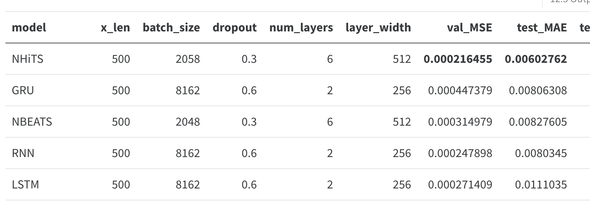

## Timeseries Learnings

**Intro**

This is a blog based on a presentation I did at Foo Café, where we shared a lot of our hard-earned wisdom at AFRY X, mainly based on working with timeseries.

There’s both simple and more advanced, hopefully in an easy to understand fashion!
<!--truncate-->

### Background

We’re currently working with two (2) assignments involving timeseries right now. 

1. Helping a telecom company to embrace Data Driven Testing of 5G-antennas
2. Helping a automotive company to forecast weird brake behavior.

  

So what have we learned? Let’s see...

## 1\. Learning to embrace KISS 💋

We learned this by a few different experiences.

### MLOps Tooling

Yes, it’s real. We all say it, all the time. But when the dust settles a lot of us ended up optimizing some part of our code anyways or even adding the “better tool” which involves just a “tiny bit” more complexity and code.

  

Well, we did end up adding that “better tool” and it bit us back by clearly reducing our innovation pace. The story...

To build our MLOps pipeline we used a tool (DVC) which is way better than the “default” of MLFlow. It has multiple bonuses:

1. **Data** Version Control  
    
2. **Reproducible** Pipelines  
    
3. **CI/CD** custom-made for Machine Learning  
    
4. **Cloud & Tool Agnostic**  
    
5. **Simply `git`**

  

There’s no real drawbacks, except the KISS principle. Don’t get me wrong DVC is an excellent tool but we ended up having to write a lot of code to download datasets, track models, keep things tidy in git. To top it off? It was cumbersome to test a new task inside the same repository.

The biggest drawback was the additional code, albeit not complex in itself it added a total complexity, each time we wanted to update something in the pipeline we had to make sure to keep DVC working.  
And to get new features it was a little bit of adding lego bricks, which I love but ended up adding more complexity again.  
I want to note that the complexity was from lines of code rather than complicated code and this complexity made it harder for us to innovate.

  

Biting the bullet and migrating to MLFlow, an inferior tool on the paper, made our pipelines more lean and easier to innovate upon.  
MLFlow has magic integrations into all cloud providers and libraries which makes it very easy to add with basically 0 code.

This simplification led to further gains which are hard to show on paper.

  

In the end with our small team-size and project-size the gains of DVC isn’t worth the cost, as such the KISS approach leads us to MLFlow.

### Local ↔ Cloud

Cloud compute brings a ton of goodies such as defaulting to containerization, which should be done locally to really, and having powerful computers at your fingertips.

But what is forgotten is that with great powers comes great responsibility. Cloud enables training heavy models but with that it hides a lot of problems.

1. Inefficient pipelines
2. Hard to debug
3. ...

We've learned that using a _Local First Approach_ gives us the best of both worlds. Our pipelines are able to run fully local, including unit testing, but are just as simple to run on a cluster.

This is enabled by using a local pipeline rather than fully embracing the ecosystem. 

We are able to run:

- `⁠pipeline.py`  
    
- `pipeline_on_azure.py --exp_name <NAME> --compute <COMPUTE>`
- `pipeline_mlflow_azure.py`

    - Allows local experiments to be tracked on Azure MLFlow server rather than locally

Which makes our life incredibly easy!

### Automate Boring Checks

Of course code reviews should, and is, mandatory. Based on our software engineering principles we’ve made sure to also add CI/CD verifications which validates that everything is nice and tidy with no breaking changes. It reduces our cognitive load, which is awesome.

Our current set-up:

- **[pre-commit](https://pre-commit.com/ "https://pre-commit.com/"):** local validation on each commit

    - `[flake8](https://github.com/pycqa/flake8 "https://github.com/pycqa/flake8")`: Code Style Checker

        - Validates that we don’t break code-styles such as unused imports, unused variables, too complicated functions etc

    - `[black](https://github.com/psf/black "https://github.com/psf/black")`: Code Formatter

        - It’s uncompromising and makes sure our repository has a standard stylistic with correct indenting and much more

    - `[mypy](https://github.com/python/mypy "https://github.com/python/mypy")`: Static Type Checker

        - Makes sure that our types are valid and we’re not simply lucky in the duck-typing 🦆 world of Python 🐍!

    - **^ All above also runs in CI/CD**

- **CI/CD**

    - [**pytest**](https://docs.pytest.org/en/7.2.x/ "https://docs.pytest.org/en/7.2.x/")**:** unit tests

        - Test that your functions, neural networks etc works as expected

    - **pre-commit** - see above
    - **[cypress](https://cypress.io/ "https://cypress.io/"):** E2E frontend testing

        - Only for a user-facing analysis tool

This is running on both GitHub Actions and GitLab Pipelines.

We deploy our containers through Azure and experiment through the Azure ML Studio or locally.

  

## 2\. Interactive Validation 👨‍💻

This is the killer deal. A lot of people out there makes heavy use of what I call “Static Analysis”, where metrics and static images are viewed. 

Viewing static results isn’t enough, it barely scraps the surface and we’re _Data \*_ right? So why not dive into the data!? 🕵️

We’re extending our analyses to include custom built Streamlit Application(s) which allows us to work exploratory. Static validation is still important to keep track of actual objective metrics, but exploration is not only very satisfying but also awesome as you learn so much more about the model(s) and data.

Interactive analysis gives the following: _Promote Explorability, Gives End-User a Great Experience, Increase Explainability, Efficient Feedback-Loop_. Awesome? Hell yeah! 😎

**Static Validation:**

  

**Interactive Validation:**

**  
**

## 3\. Additional Wisdom 🤓

### Probabilistic Forecasting

This is a powerful tool to have in your arsenal, and with clever tricks you can have it with _all_  neural networks that uses dropout! 🤯

The idea is that rather than forecast/predict point by point we forecast a confidence interval! This way we capture uncertaintied of the model.  This  assists debugging your model to fix its weaknesses! 🔍

  

### Custom Loss Functions

Using a custom loss function makes a lot of sense in almost any real problem. It’s very rare that you actually care about the overall impact, but rather specific regions actually matters in time-series. In our case we don’t care about forecasting noise nor do we care about forecasting the bad behavior after it happened, we need to find it before it happens - forecasting.

In our case it's an oscillating behavior that builds amplitude over time, as we want the model to do the same we need to penalize undershooting heavily to not fit it to the noice.

This ended up being a big improvement, but what lessons did we learn?

1. Always invert scale before calculating test-metrics

- To not allow scaling functions to impact the final results

3. Never optimize a loss function that you use as a metric

- This will play the model

5. Decide on validation metrics _before_  you start

- A moving target is impossible to hit and compare against

## 4\. Unexpected Learnings 🤔

### Model weights badly instantiated

We found this to be true in both papers and (5k⭐️) Open Source libraries. 

Make sure that you validate code you’re using in-depth and don’t expect it to work as expected from the get-go!

### Best Practices is contextual

Best Practices are certainly not true for any example or user. This was shown in multiple cases, such as our Local ↔ Cloud story.

Make sure to validate that what you’re doing is actually required for your use-case. A lot of the tools out there is built for _huge scale_ while we’re working on _small-medium scale_. To use the same tooling is to introduce a large overhead and disconnect from the developer.

  

## Generally winning concepts

- **Type hints**, Type Hints everywhere

    - It really assists you greatly. As a Scala/Kotlin and FP-enthusiast I’d like to talk even further about it, but I might grow boring.

- **Plotly/Altair** rather than matplotlib – interactivity is king.

    - 
    - I cannot emphasize how much is learnt by the kinder Garten style of panning, zooming and playing around
    - It gives data and model understanding

- **Polars** **–** efficient speedy DataFrame’s with a _logical API_

    - I can't be alone thinking that whoever designed pandas API must've been a masochist

        - Polars makes sense, includes lazy and it's fast! 🏎️
        - Con: it's not lingua franca like pandas and thereby isn't supported automatically by all different libraries

            - Solved by using `to_pandas()`

    - _
    
    ```python
    >>> df.sort("fruits").select(
    ...     [
    ...         "cars",
    ...         pl.col("B").filter(pl.col("cars") == "beetle").sum(),
    ...         pl.col("A").filter(pl.col("B") > 2).sum().over("cars").alias("sum_A_by_cars"),
    ...         pl.col("A").sum().over("fruits").alias("sum_A_by_fruits"),
    ...         pl.col("A").reverse().over("fruits").alias("rev_A_by_fruits"),
    ...         pl.col("A").sort_by("B").over("fruits").alias("sort_A_by_B_by_fruits"),
    ...     ]
    ... )
    ```
    
      
    
    
    _

    -   
    

- **Streamlit** quick interactive apps that makes a huge difference

    - This is how we build our interactive validation and analysis tools. 

- **CI/CD** on all projects

- **Quarto** reports

    - They're amazing, think markdown + code cells + all the goodies of LaTeX in a package 😍

- **Use Path-lib from the get-go**

    - Don’t waste a full working day of headache to help that Windows-user to run your project

  

# Summarizing

- Follow **KISS**
- **Embrace the systems you’re working in,** it’ll pay off to not generalize too much

    - Whenever you change cloud-provider you’ll have to update a lot of code anyways because of auth and more

- **Interactive Analysis** is incredible and open new doors
- Always **be mindful**

    - Continuously evaluate, iterate and execute – be agile.

  

That’s it for now

~Hampus Londögård