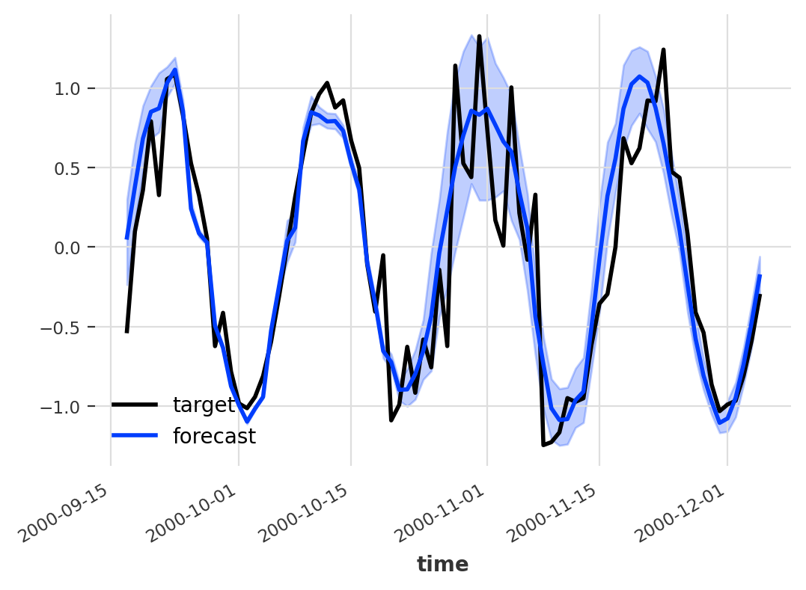

## Probabilistic Forecasting Made Simple

Probabilistic Forecasting is something very cool, but it is not approachable in the current state of affairs. 

While researching probabilistic forecasting in a client project I managed to find a paper which opens the door to **any** neural network _with dropout_ - which is the majority. That is, we can do probabilistic forecasting with essentially any network!  
<!--truncate-->

[Darts](https://github.com/unit8co/darts "https://github.com/unit8co/darts"), a brilliant timeseries library, includes a very competent probabilistic forecasting but it’s not really applicable to all models. This is the reason that I started diving into the whole space of probabilistic forecasting. A probabilistic model includes not only a raw prediction value but a distribution of possible points, which ends up with a prediction like:

  

  

> Probabilistic Model by [unit8/darts](https://unit8.com/resources/probabilistic-forecasting-in-darts/ "https://unit8.com/resources/probabilistic-forecasting-in-darts/")  

  

Additionally models like ARIMA and ExponentialSmoothing allows to do this kind of thing very easily, simply sample running simulations of their state-spaced models with a bit of randomly sampled errors. To solve this on their deep learning models darts decided to model distribution using a `Likelihood`  class. What does this mean?  
The model does not actually predict a value but a distribution, using `Gaussian`  we’d predict two values - `mean`  and `std` .  

## How to do probabilistic forecasting on any deep learning model  

By combining the knowledge in _[Deep and Confident Prediction Time Series at Uber](https://arxiv.org/pdf/1709.01907.pdf "https://arxiv.org/pdf/1709.01907.pdf")_ by L. Zhi & N. Laptev (2017) with _[What Uncertainties Do We Need in Bayesian Deep Learning for Computer Vision?](https://arxiv.org/pdf/1703.04977.pdf "https://arxiv.org/pdf/1703.04977.pdf")_ by A. Kendall & Y. Gal (2017) one can conclude that it’s possible to model distributions using dropout during inference. In the Uber paper they use a special variant they call “Monte Carlo dropout”, which I don’t believe is required to achieve interesting results. Using the pure dropout-module which randomly zeroes some elements by a probability p  sampling from a Bernoulli Distribution.

**How do we do this?**

1. Activate Dropout during Inference.
2. Do x  predictions with a dropout probability p.
3. Based on these x predictions we have a distribution of data.
4. Build a _confidence interval_ from the points.

  

## The possibilities

There’s a lot of possiblities, I’ll share two of our biggest ones.

#### 1\. Model Understanding (Weakness/Strength)

By returning a _probabilistic forecast_, i.e. a distribution/confidence interval, we can learn more about the model and its strengths/weaknesses. 

In our project(s) we’ve seen that it opens a door to really figure out how to improve our models by focusing on the areas were the model is the most uncertain. This has proved to improve performance by a substantial amount which makes the effort worth it.

#### 2\. Downstream Consumer Happiness

We see that our clients trust the model further by being able to see how confident they are. Building trust between model and downstream consumer is really important to deliver an actual successful project, which once again makes the effort totally worth it!

  

**Bonus:** we also found that it opens new possibilities to chain of the inference power if you keep it in production, as your downstream tasks can now make use of a confidence interval rather than a raw data point. But the inference is very expensive compared to the usual (remember we do x predictions per prediction)!

  

## Sources

_[Deep and Confident Prediction Time Series at Uber](https://arxiv.org/pdf/1709.01907.pdf "https://arxiv.org/pdf/1709.01907.pdf")_ by L. Zhi & N. Laptev (2017) - [https://arxiv.org/pdf/1709.01907.pdf](https://arxiv.org/pdf/1709.01907.pdf)  

_[What Uncertainties Do We Need in Bayesian Deep Learning for Computer Vision?](https://arxiv.org/pdf/1703.04977.pdf "https://arxiv.org/pdf/1703.04977.pdf")_ by A. Kendall & Y. Gal (2017) - [https://arxiv.org/pdf/1703.04977.pdf](https://arxiv.org/pdf/1703.04977.pdf)