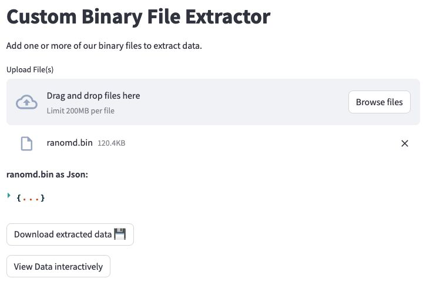

**Amazing one-off tools deployed as a URL that embeds a WASM app is officially here! 🤯**

Wow, that was a mouthful! There's a mini-breakdown of the tech utilized to enable this at the bottom.👇

What does this mean? It means that I can build assistive apps that has the following properties:

1. Deplyed as a URL - **no server, no nothing**, simply share away 🦸
2. Runs completely inside browser, on the user-device 💻
3. Requires NO developer or developer environment to run! 😇

This is what I call truly Serverless! Because code and everything is embedded in the URL and runs inside a contained environemnt in the browser it cannot be simpler to share one-off tools!
I'm excited to utilize this a lot more to enable my colleagues in sister-teams!

Here is a URL for a tool that does real-time image processing **in the browser**: [stlite.net](https://edit.share.stlite.net/?sampleAppId=realtime_image_processing)!
Here's where you can work inside the browser to build a script: [edit.share.stlite.net](https://edit.share.stlite.net/).

**Tech breakdown that enables everything:**
1. Emscripten/WASM enables C code running efficiently in the browser
2. Pyodide is a cPython port to Emscripten/WASM that works brilliantly, including micropip that enables a bunch of libraries
3. Stlite is a Streamlit port to Pyodide (with few caveats)

P.S. I heard that Solara is potentially working on the same functionality natively 😉