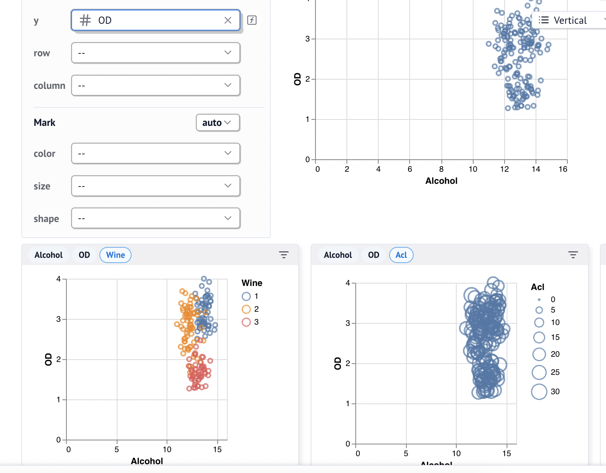

This post will be short, I recently built a WASM app that allows you to 1) convert between Parquet/CSV/JSON and 2) explore the data using Marimos built-in tooling.  

I shared an initial introduction to marimo in a [blog earlier](/posts/2025-02-17-marimo).

::: {.callout-tip}
In short **marimo** is an up-and-coming Notebook that also have "App-mode" and can run using WASM.
:::

## App:Converter

There's multiple libraries suppoted in Pyodide, Python WASM, among them: `polars`, `duckdb` and `pandas`.  
All these libraries are exceptional, with `pandas` as a exception 😉, to do Data Science and work with tabular data. They also have read/write support for `JSON`, `CSV` and `parquet` files.

::: {.callout-tip}
**Parquet** is an awesome format for reading data, it's  _small, fast & efficient_ which in turn enables magnitudes better performance (10-100x easily).  
:::

These tools enable my simple _converter_ that allows more people to easily move _from CSV/JSON to Parquet_, and in turn have faster plotting!

As always there's some problems implementing:

* `polars` doesn't support parquet/JSON in WASM 
    * --> fall-back to `duckdb`. 
    * `duckdb` can't read parquet from`io.BytesIO`
        * --> fall-back to... `pandas` 🤦‍♂️.
        * Luckily we can quickly call `pl.from_pandas` to run `polars`!

I hope to add more formats moving forwards, such as `ndjson` and `xlsx`.


## App:Explore

Data Exploration - a important part and initial step when working with data of any type.  
When exploring your dataset it's good to have a streamlined way of working. Marimo has some excellent tooling to quickly structure your data. **I've added all these tools in my simple WASM app**, things include like:


::: {layout-ncol=2}



:::

These tools combine into a quite neat exploration app. If you run this notebook locally you can easily hit up the _code cells_ and modify the DataFrames manually and keep utilizing the nifty UI features such as statistics in DataFrame columns or visualization.

All in all this is a simple quick-starter, I think this app can be helpful for those who wants to explore their data, advaned or simple.

## Result

::: {.callout-tip appearance="minimal"}

## WASM Spreadsheet Explorer/Converter (CSV, JSON & Parquet) App
[Also available as stand-alone](/pages/app_spreadsheet.qmd)

```{=html}

<iframe width="100%" height="720" src="/assets/wasm/spreadsheet/app/index.html"></iframe>
```

:::


# Outro

I'll keep adding more WASM apps with time. I love Pyodide.

Combining WASM with Marimo, or `stlite`, feels like such a natural fit.  
Marimo to me combines the perfection of Notebook Exploration with Apps, hence I opted for Marimo now.

Moving on I'll add more in-depth blogs about Marimo and why it's awesome, embedding WASM snippets and more.

Thanks for this time,  
Hampus Londögård